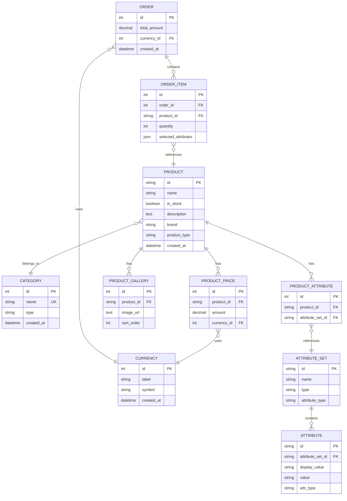

# SW - E-commerce Project

A full-stack e-commerce application with GraphQL API backend and React frontend, built according to the [Scandiweb Junior Full-Stack Developer test task requirements](https://scandiweb.notion.site/Junior-Full-Stack-Developer-test-task-3833494124714845b71bf46096b6eeb9#a786a76ed71b453cb698c4a4a7cb1fc3).

**Backend URI**: `https://sw-ecommerce.alwaysdata.net` (works only with this frontend origin)

**Frontend URL**: `https://sw-ecommerce-fs.netlify.app/`

## Project Overview

This project demonstrates a modern e-commerce solution with:

- **Backend**: PHP-based GraphQL API with Doctrine ORM
- **Frontend**: React TypeScript application with modern tooling
- **Database**: MySQL
- **Architecture**: Clean separation of concerns with proper data loading and caching
- **Code Quality**: Respected PSR-4. PSR-1 and PSR-12 compliant with automated linting

## Project Structure

```
SW/
├── backend/                 # PHP GraphQL API
│   ├── src/
│   │   ├── Controller/     # GraphQL controller
│   │   ├── Database/       # Database management & data loaders
│   │   ├── Entity/         # Database entities/models
│   │   └── GraphQL/        # GraphQL schema & resolvers
│   ├── database/           # Production database migrations
│   ├── dev-database/       # Development database schemas
│   ├── bootstrap.php       # Environment and autoloader setup
│   └── public/             # Web server entry point
└── frontend/               # React TypeScript application
    └── src/                # React components & logic
```

## Backend Architecture

### Technology Stack

- **PHP 8.1+**: Core backend language
- **Doctrine ORM**: Object-relational mapping for database operations
- **Webonyx GraphQL PHP**: GraphQL library for PHP (not a framework, just a GraphQL implementation)
- **Overblog DataLoader PHP**: Efficient data loading with caching to prevent N+1 queries
- **Symfony Cache Component**: Used internally by libraries for caching (not a framework, just a caching component)
- **React Promise**: Asynchronous promise handling for PHP
- **Nikic Fast Route**: High-performance routing library (not a framework, just a routing library)
- **Composer**: Dependency management

### Code Quality & Standards

The backend follows strict PHP coding standards:

- **PSR-1**: Basic Coding Standard (no side effects in class files)
- **PSR-12**: Extended Coding Style (line length, formatting, etc.)
- **OOP Principles**: Proper object-oriented design patterns
- **Clean Architecture**: Separation of concerns and maintainable code

#### Linting Commands

```bash
# Check code quality (PSR-1 and PSR-12)
composer lint

# Auto-fix formatting issues (where possible)
composer lint-fix
```

#### Bootstrap Architecture

The project uses a centralized bootstrap approach for environment management:

- **`bootstrap.php`**: Centralized environment loading and autoloader setup
- **PSR-1 Compliance**: No side effects in class files
- **Clean Separation**: Environment setup separated from business logic
- **Consistent Loading**: All entry points use the same bootstrap process

### Database Schema

The application uses a comprehensive e-commerce database schema with the following entities:



### Key Features

1. **Inheritance Support**: Products and Categories use single-table inheritance for different types
2. **Flexible Attributes**: Dynamic attribute system with text and swatch types
3. **Multi-currency Support**: Products can have prices in different currencies
4. **Image Gallery**: Products support multiple images with sort order
5. **Order Management**: Complete order processing with selected attributes

### GraphQL Schema

The GraphQL API provides a flexible interface for data querying:

```graphql
type Query {
  categories: [Category!]!
  products(categoryId: Int): [Product!]!
  product(id: String!): Product
}

type Mutation {
  placeOrder(input: PlaceOrderInput!): Order!
}

type Product {
  id: String!
  name: String!
  inStock: Boolean!
  description: String
  category: Category!
  brand: String
  prices: [Price!]!
  gallery: [ProductImage!]!
  attributes: [AttributeSet!]!
}
...
```

### Resolver Architecture

The backend uses a sophisticated resolver system:

- **ResolverManager**: Central coordinator for all GraphQL resolvers
- **Specialized Resolvers**: Separate resolver classes for each entity type
- **Data Loaders**: Efficient data loading with caching to prevent N+1 queries using Overblog DataLoader
- **Caching**: Multi-level caching with DataLoader caching and Symfony Cache component
- **Async Operations**: React Promise for handling asynchronous database operations

#### Resolver Structure

```
GraphQL/Resolvers/
├── ResolverManager.php      # Main resolver coordinator
├── QueryResolvers.php       # Root query resolvers
├── MutationResolvers.php    # Mutation resolvers
├── ProductResolvers.php     # Product-specific resolvers
├── CategoryResolvers.php    # Category-specific resolvers
├── AttributeSetResolvers.php # Attribute resolvers
├── OrderResolvers.php       # Order resolvers
└── OrderItemResolvers.php   # Order item resolvers
```

### Database Management

#### Development vs Production

- **`dev-database/`**: Development database schema and sample data
  - `mysql.sql`: MySQL development schema with sample data
  - `init/`: PHP initialization scripts for easy database setup
    - `cmdOption.php`: Interactive command-line initialization
    - `pdoOption.php`: PDO-based initialization
    - `oneLinerOption.php`: Simple one-liner initialization
- **`database/`**: Production database migrations
  - `migrations/`: Database migration files for deployment
  - `seeds/`: Production data seeding

#### Data Loading Strategy

- **EcommerceDataLoaderManager**: Centralized data loading with caching
- **Specialized Loaders**: Separate loaders for each entity type (Product, Category, Attribute, Order)
- **Overblog DataLoader**: Efficient batching and caching to prevent N+1 queries
- **React Promise**: Asynchronous promise resolution for better performance
- **Multi-level Caching**: DataLoader caching + Symfony Cache component for optimal performance

## Doctrine Proxy Classes

Doctrine uses proxy classes to enable lazy loading of entities. In development, proxies are generated in memory on-the-fly, so no manual action is needed. In production, for optimal performance and stability, proxies should be pre-generated and stored in the `backend/var/cache/doctrine/proxies/` directory.

**What to do in production:**

After deploying new or changed entities to your production server, run the following command to generate all required proxy classes:

```bash
php backend/generate-proxies.php
```

This ensures Doctrine can efficiently lazy-load entities without runtime errors or performance issues. The `backend/var/cache/doctrine/proxies/.gitkeep` file is present to ensure the directory exists in your repository, but it should remain empty.

For more details, see the [Doctrine ORM documentation on proxy classes](https://www.doctrine-project.org/projects/doctrine-orm/en/3.5/reference/advanced-configuration.html#generating-proxy-classes).

## Frontend Architecture

### Technology Stack

- **React 19**: Modern React with latest features
- **TypeScript**: Type safety and better developer experience
- **Vite**: Fast build tool and development server
- **Tailwind CSS**: Utility-first CSS framework for styling
- **React Router v6**: Client-side routing with data loading (not a framework, just a routing library)
- **Apollo Client**: GraphQL client for API communication (small library, not a framework)
- **Zustand**: Simple global state management (not a UI library or framework, just a state management tool)
- **Lucide React**: Icon library

### Key Features

1. **Type Safety**: Full TypeScript implementation
2. **Modern Routing**: React Router v6 with data loading capabilities
3. **State Management**: Zustand for simple, efficient state management
4. **GraphQL Integration**: Apollo Client for seamless API communication
5. **Responsive Design**: Tailwind CSS for modern, responsive UI
6. **Component Architecture**: Modular, reusable components

### Frontend Structure

```
frontend/src/
├── components/
│   ├── pages/              # Page components
│   │   ├── ProductsList.tsx    # Main products listing page
│   │   └── ProductDetails.tsx  # Individual product detail page
│   └── ui/                 # Reusable UI components
│       ├── layout/         # Layout components (AppLayout, Navbar)
│       ├── ProductCard.tsx # Product display card
│       ├── CartModal.tsx   # Shopping cart modal
│       ├── CartBtn.tsx     # Cart button component
│       ├── GalleryCarousel.tsx # Product image carousel
│       ├── GalleryThumbnails.tsx # Product image thumbnails
│       ├── TextAttribute.tsx # Text-based product attributes
│       ├── SwatchAttribute.tsx # Color swatch attributes
│       ├── Logo.tsx        # Application logo
│       ├── Spinner.tsx     # Loading spinner
│       └── Error.tsx       # Error display component
├── services/               # API and data services
│   ├── apolloClient.ts     # GraphQL client configuration
│   ├── data.ts            # Data loading functions with React Router
│   └── gqlSchema.ts       # GraphQL schema type definitions
├── store/                  # State management
│   └── useCartStore.ts     # Global cart state with Zustand
├── types/                  # TypeScript type definitions
│   ├── Product.ts         # Product interface
│   ├── Category.ts        # Category interface
│   ├── Order.ts           # Order interface
│   └── Attribute.ts       # Attribute interface
├── utils/                  # Utility functions
└── router/                 # Routing configuration
    └── routes.ts           # Route definitions with data loading
```

### State Management

- **Zustand**: Simple, lightweight state management
- **Cart Store**: Global cart state with persistence
- **No Complex State**: Avoids over-engineering with simple, effective solutions

## Getting Started

### Prerequisites

- PHP 8.1+
- Node.js 18+
- Composer
- MySQL (running on your machine)
- Environment configuration (.env file)

### Backend Setup

1. **Install Dependencies**

   ```bash
   cd backend
   composer install
   ```

2. **Environment Configuration**

   ```bash
   # Copy and configure environment file
   cp .env.example .env
   # Edit .env with your MySQL credentials
   ```

   The project uses a centralized bootstrap approach (`bootstrap.php`) for environment loading, ensuring PSR-1 compliance.

3. \*\*Database Setup

   **Option 1: Direct MySQL Import**

   ```bash
   # For development
   mysql -u root -p < dev-database/mysql.sql
   ```

   **Option 2: PHP Initialization Scripts**

   Run one of the initialization scripts (environment should be configured in step 2):

   ```bash
   # Command line option (interactive)
   php dev-database/init/cmdOption.php

   # PDO option
   php dev-database/init/pdoOption.php

   # One-liner option
   php dev-database/init/oneLinerOption.php
   ```

   **For production**

   ```bash
   php database/migrate.php
   ```

4. **Code Quality Checks**

   ```bash
   # Check code quality (PSR-1 and PSR-12)
   composer lint

   # Auto-fix formatting issues (where possible)
   composer lint-fix
   ```

5. **Start Development Server**

   ```bash
   php -S localhost:8000 -t public
   ```

### Frontend Setup

1. **Install Dependencies**

   ```bash
   cd frontend
   npm install
   ```

2. **Start Development Server**

   ```bash
   npm run dev
   ```

3. **Build for Production**

   ```bash
   npm run build
   ```

## Development Notes

### Development Workflow

1. **Code Quality**: Always run `composer lint` before committing
2. **Auto-fix**: Use `composer lint-fix` to automatically fix formatting issues
3. **Bootstrap**: All PHP files should use `require_once __DIR__ . '/../../bootstrap.php';` for environment loading
4. **PSR Compliance**: Maintain PSR-4, PSR-1 and PSR-12 standards throughout the codebase

### Technology Choices Explained

**Backend:**

- **Webonyx GraphQL PHP**: GraphQL library for PHP, not a framework - just a GraphQL implementation
- **Overblog DataLoader PHP**: Efficient data loading with batching and caching to prevent N+1 queries
- **Symfony Cache Component**: Used internally by libraries for caching, not a framework - just a caching component
- **React Promise**: Asynchronous promise handling for PHP operations
- **Nikic Fast Route**: High-performance routing library, not a framework - just a routing library
- **Doctrine ORM**: Provides robust database abstraction and query optimization
- **Bootstrap Architecture**: Centralized environment loading with PSR-1 compliance

**Frontend:**

- **React Router v6**: Handles routing with data loading capabilities, not a framework
- **Apollo Client**: Small library for GraphQL client-side operations, not a framework
- **Zustand**: Simple tool for global UI state management, not a UI library or framework
- **Tailwind CSS**: Utility-first CSS for rapid UI development

### Performance Optimizations

1. **Multi-level Caching**: Overblog DataLoader caching + Symfony Cache component for database requests
2. **Efficient Data Loading**: DataLoader batching prevents N+1 queries and optimizes database calls
3. **Asynchronous Operations**: React Promise for non-blocking PHP operations
4. **High-performance Routing**: Nikic Fast Route for efficient request handling
5. **GraphQL Optimization**: Webonyx GraphQL PHP reduces over-fetching and under-fetching
6. **Code Splitting**: Vite provides automatic code splitting
7. **Type Safety**: TypeScript prevents runtime errors

### Compliance with Requirements

This project strictly adheres to the [Scandiweb test task requirements](https://scandiweb.notion.site/Junior-Full-Stack-Developer-test-task-3833494124714845b71bf46096b6eeb9#a786a76ed71b453cb698c4a4a7cb1fc3):

- ✅ No frameworks used (only libraries and components)
- ✅ Followed requested PSRs (PSR-1, PSR-12, PSR-4) for coding standards
- ✅ Strictly followed OOP principles in backend development
- ✅ GraphQL API
- ✅ Modern React with TypeScript
- ✅ Clean, maintainable code structure
- ✅ Proper state management
- ✅ Responsive design
- ✅ Type safety throughout the stack
