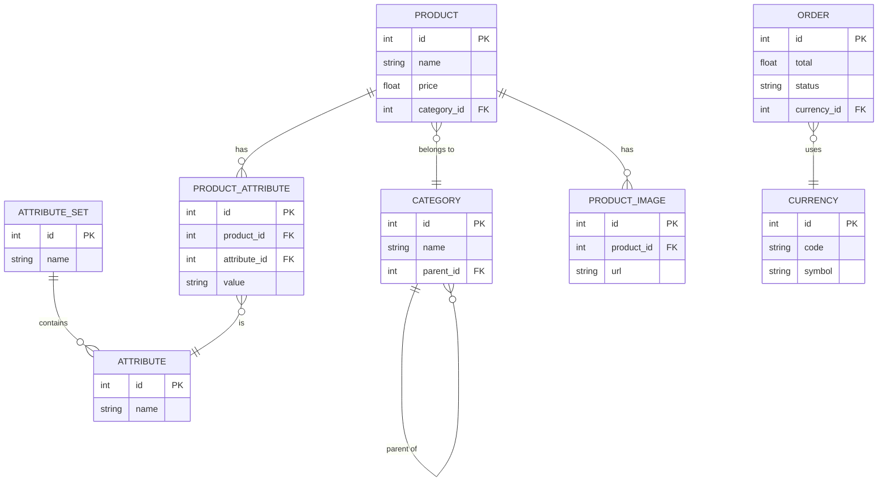

# Backend

This is the backend for the SW project. It is built with PHP and provides APIs for managing products, categories, orders, and attributes.

## Getting Started

### Requirements

- PHP 7.4+
- Composer

### Running the Development Server

```sh
php -S localhost:8000 -t public
```

## Database Schema

Below is an overview of the main database entities and their relationships, represented in Mermaid ER diagram syntax.



## Entities

- **Product**: Represents a product for sale.
- **Category**: Organizes products into categories (supports parent-child relationships).
- **Attribute**: Defines a characteristic (e.g., color, size).
- **AttributeSet**: Groups attributes together.
- **ProductAttribute**: Assigns attribute values to products.
- **ProductImage**: Stores images for products.
- **Order**: Represents a customer order.
- **Currency**: Represents the currency used in orders.
